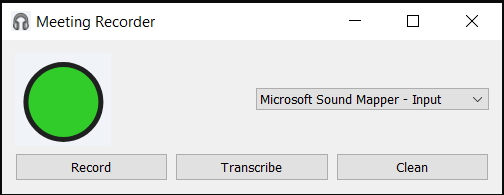

# AudioSumma

Record your local audio and summarize it with whisper.cpp and llama.cpp!  Open source, local on-prem transcription and summarization!



## Installation

```
pip install -r requirements.txt
```

## Configuration

Copy sample.env to .env and point your endpoint URLs for a working llama.cpp and whisper.cpp running in server/api mode.

## llama.cpp/ollama and whisper.cpp

These need to be running in server mode somewhere on your local machine or on your network.  Add the endpoints to your .env

The default values are correct if you run whisper.cpp and ollama server or llama.cpp server on your local machine.

## Running

Run either meetings.bat or meetings.sh to start app.


## Usage

Hit record to record your global audio, hit stop to save the wav file.  Hit transcribe to transcribe all wav files collected into a single summary markdown document (with date stamp).  Hit the Clean button to remove old wav files and transcripts.

